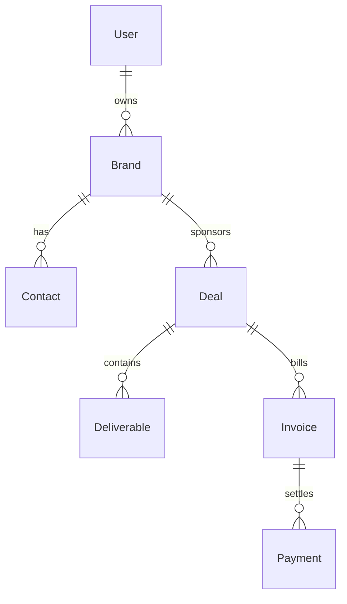

# Brands CRM Foundation Notes

## Ownership And Isolation

- All brand CRUD/list/detail operations are user scoped in `app/action/brandActions.ts`.
- The authenticated owner is always derived from `requireOnboardedUser()`.
- Brand queries always include `userId: user.id` to prevent cross-user data access.
- Client payloads never provide ownership identifiers.
- Duplicate checks are owner scoped with `normalized_name` and unique index:
  - `brands_user_id_normalized_name_key`

## Current Security Model

- Application-level isolation: enforced in server actions.
- Session-level protection: dashboard routes remain protected by `proxy.ts` and onboarding checks in dashboard layout.
- Error handling is generic for user-facing messages and structured in logs.

## RLS Rollout Plan

1. Keep application ownership checks as primary guard in Sprint 2.
2. Add DB RLS policy for `brands` in a later hardening sprint.
3. Keep ownership checks in code even after RLS as defense in depth.

## Future Module Relationships

- `Brand` is the canonical sponsor entity for CRM modules.
- Future modules should reference `brandId` instead of duplicating brand metadata.
- Selective denormalization is still allowed for historical snapshots (for example invoice recipient name at send time).
