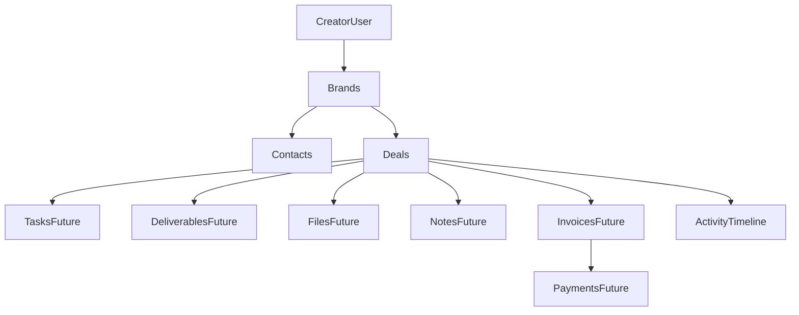

# Deals Module

## Module Overview

Deals are the commercial execution center of CreatorOS. Brands and contacts describe relationships; deals convert those relationships into outcomes such as deliverables, invoices, and payments.

This module is designed to:
- track a deal from first outreach to payment closure,
- provide one source of truth for deal financial and timeline state,
- act as the parent entity for future operational modules.

## Why Deals Are Core

- **Revenue mapping:** each deal carries value, due dates, and payment expectations.
- **Execution hub:** tasks, deliverables, files, and notes attach to a deal context.
- **Financial spine:** invoices and payments are downstream of deal lifecycle state.
- **Analytics foundation:** widgets and forecasting derive from deal stage and value.
- **AI readiness:** a normalized deal context enables future recommendations and automation.

## Business Rules

1. Every deal belongs to one user (`userId`) and one brand (`brandId`).
2. A linked contact is optional, but when provided it must belong to the same user and brand.
3. Active duplicate prevention: same user + brand + normalized campaign name cannot exist in parallel non-terminal active stages.
4. Pipeline stages define lifecycle progression and can be updated from table, kanban, or detail.
5. Archived deals are hidden from active views but remain recoverable.
6. Delete is restricted to terminal deals (`Paid` or `Cancelled`).
7. All deal mutations record timeline activity in the same transaction as data writes.

## Deal Lifecycle State Machine

Primary stages:
- `Lead`
- `Contacted`
- `Negotiation`
- `ProposalSent`
- `ContractSigned`
- `Active`
- `Delivered`
- `Completed`
- `Paid`
- `Cancelled`

Transition policy:
- Paid and Cancelled are terminal stages.
- Non-terminal transitions are validated through server-side stage transition rules.
- Stage changes update `lastStageChangedAt`.
- Milestone timestamps (`deliveredAt`, `completedAt`, `paidAt`) are stamped automatically when entering those stages.

## Relationships

## Data Contract

Deal entity fields include:
- identity: `id`, `userId`, `brandId`, `contactId`
- commercial: `campaignName`, `dealValue`, `currency`, `paymentTerms`
- lifecycle: `stage`, `priority`, `status`, `lastStageChangedAt`
- dates: `startDate`, `dueDate`, `expectedCloseDate`, `paymentDueDate`
- content: `campaignDescription`, `deliverablesSummary`, `notes`
- reporting: `source`, `probability`, `externalRef`
- milestones: `deliveredAt`, `completedAt`, `paidAt`, `archivedAt`
- metadata: `createdAt`, `updatedAt`

## Server Architecture

Action layer:
- `listDealsAction`
- `getDealAction`
- `createDealAction`
- `updateDealAction`
- `updateDealStageAction`
- `archiveDealAction`
- `restoreDealAction`
- `deleteDealAction`
- `listDealFormOptionsAction`

Service layer:
- validation and ownership assertions are enforced before writes,
- mutation methods run inside transactions,
- domain errors are mapped to user-facing field errors,
- timeline events are emitted via `recordActivity`.

## Frontend Architecture

Routes:
- `/dashboard/deals` list (table + kanban + widgets)
- `/dashboard/deals/[id]` detail page

Core components:
- `DealsPage`
- `DealsToolbar`
- `DealsTable`
- `DealKanbanBoard`
- `DealForm`
- `DealDetailPage`
- `DealArchiveDialog`
- `DealDeleteDialog`

Hooks:
- `useDealListSearch` for URL-synced query state.
- `useDealPipeline` for optimistic kanban transitions.
- `useDealActivity` for paginated detail timeline fetches.

## Search, Filter, Sort

Search:
- campaign name
- brand name
- contact name or email

Filters:
- archive state (`active`, `archived`)
- stage
- priority
- brand
- date range (due date)

Sort:
- recently updated
- highest value
- due date

## Dashboard Widgets

Widgets on the deals list include:
- active deals count,
- revenue in progress,
- deals closing within 14 days,
- overdue deals,
- highest value active deal summary.

## Security and Multi-Tenancy

- `requireOnboardedUser()` gates all deal actions.
- all reads/writes are scoped by `userId` to prevent cross-tenant access.
- brand/contact ownership is validated in service methods.
- schema design remains compatible with strict Postgres RLS rollout later.

## Timeline Integration

Deals integrate into activity timeline using:
- `entityType = Deal`
- `dealId` relation for direct timeline filtering
- optional `brandId` and `contactId` for rollups

Events emitted:
- `DealCreated`
- `DealUpdated`
- `DealStageChanged`
- `DealArchived`
- `DealRestored`

## Future Integrations

Designed extension points:
- tasks and reminders for execution planning,
- deliverables and review workflow,
- files/contracts attachment handling,
- invoices and payment tracking,
- notification and calendar sync,
- AI-assisted stage risk scoring and follow-up recommendations.

## Sprint Execution Breakdown

### Sprint 3.1 - Foundation
- Deliverables: schema, validations, service/action contracts, CRUD + archive/restore, timeline events.
- Dependencies: existing auth/ownership utilities and CRM shared patterns.
- Acceptance: deals can be created, listed, updated, archived/restored with proper ownership enforcement.

### Sprint 3.2 - Kanban
- Deliverables: stage columns, drag/drop movement, optimistic transitions, rollback on failure.
- Dependencies: stage update action and transition guardrails.
- Acceptance: board updates persist reliably and block invalid transitions.

### Sprint 3.3 - Detail Page
- Deliverables: full detail route, overview blocks, timeline section, placeholder tabs for child modules.
- Dependencies: deal read endpoint and activity-by-deal endpoint.
- Acceptance: users can inspect full deal context from a dedicated page.

### Sprint 3.4 - Search and Filters
- Deliverables: campaign/brand/contact search, stage/priority/archive/brand filters, sort controls.
- Dependencies: list query contract and URL-synced state management.
- Acceptance: users can quickly narrow pipeline data without page instability.

### Sprint 3.5 - Dashboard Widgets
- Deliverables: active deals, revenue in progress, closing soon, overdue, highest value summaries.
- Dependencies: stable stage and due-date semantics in deal records.
- Acceptance: widgets reflect source data and support operational decision-making.

## Architectural Decisions

1. **Soft archive over hard delete** for auditability and restoration.
2. **Deal-centric timeline relation (`dealId`)** for efficient activity reads.
3. **Server-side stage validation** to preserve business integrity.
4. **Shared CRM UI primitives** to keep consistency with brands/contacts.
5. **Progressive detail placeholders** for sprinted rollout without schema churn.

## 2026-06 Campaign Workspace Update

- Deal detail now uses a modular workspace shell with URL-backed tab state.
- Workspace tabs are domain modules: Overview, Tasks, Deliverables, Notes, Files, Activity, Invoices (placeholder), Payments (placeholder).
- Deliverables, Notes, and Files now have first-class service/action/hook/component stacks tied to `dealId`.
- Campaign templates can be applied from deal overview to seed tasks, deliverables, and kickoff notes.
