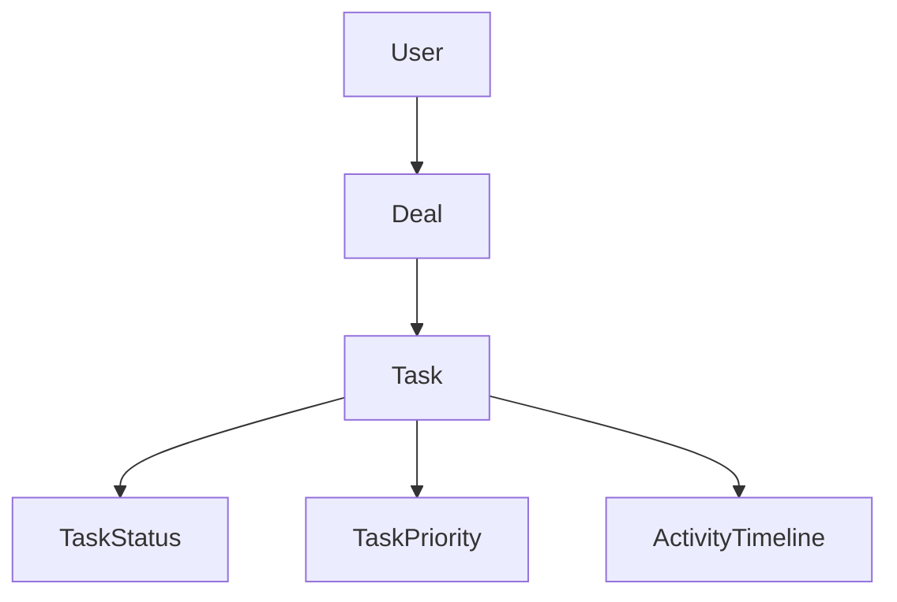
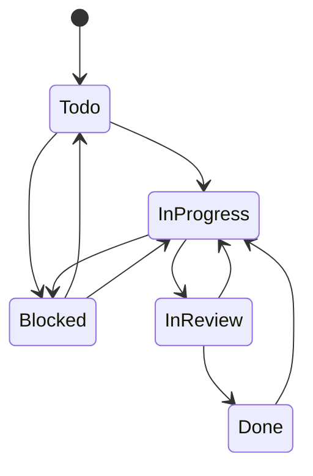

# Tasks Architecture

## Business Goals

- Turn every deal into an execution workspace where internal work is trackable.
- Surface operational risk early via overdue/upcoming signals and transition constraints.
- Keep Tasks as a clean parent for future modules (calendar, notifications, AI) without schema churn.

## Domain Model

`Task` is a deal-owned entity with strict tenant scoping:

- `id`, `userId`, `dealId`
- `title`, `normalizedTitle`, `description`
- `status`: `Todo | InProgress | Blocked | InReview | Done`
- `priority`: `Low | Medium | High | Urgent`
- `dueDate`, `orderIndex`
- `isArchived`, `archivedAt`
- `createdBy`, `updatedBy`, `createdAt`, `updatedAt`

## Relationships

Rules:

- A task belongs to exactly one deal.
- A deal can have many tasks.
- Task writes require owned deal/task checks by `userId`.
- Tasks are soft-archived first; hard delete is allowed only for archived tasks.

## State Machine

Server guarantees:

- New tasks must start in `Todo`.
- Invalid transitions are rejected in service methods.
- UI only offers allowed next transitions (`current + legal next`).

## API Design

Server actions in `app/action/taskActions.ts` follow the CRM action contract:

- `listDealTasksAction`
- `getTaskAction`
- `createTaskAction`
- `updateTaskAction`
- `updateTaskStatusAction`
- `archiveTaskAction`
- `restoreTaskAction`
- `deleteTaskAction`
- `reorderTasksAction`

Response shape:

- Mutations: `{ success, message?, data?, fieldErrors? }`
- Reads: `{ success, data? | message? }`

## Folder Structure

- `lib/crm/tasks/taskValidation.ts`: Zod contracts, field error helpers, normalization.
- `lib/crm/tasks/taskForm.ts`: form DTO adapters and FormData builders.
- `lib/crm/tasks/taskDate.ts`: date-only parsing/formatting helpers.
- `lib/crm/tasks/taskService.ts`: ownership checks, state machine enforcement, Prisma writes, activity logging.
- `app/action/taskActions.ts`: auth + parse + service orchestration + revalidation.
- `hooks/useDealTasks.ts`: list/filter/pagination state + refetch.
- `hooks/useTaskMutations.ts`: mutation orchestration and loading states.
- `components/modules/crm/tasks/*`: deal-scoped task workspace UI.
- `types/task.ts`, `enums/task.ts`: shared contracts and transition utilities.

## Technical Decisions

- Keep Tasks deal-owned only (no independent task ownership model).
- Keep business rules in service layer; UI remains orchestration/presentation.
- Enforce ownership and archive constraints server-side for every mutation.
- Record task activity events inside the same DB transaction as the mutation.
- Revalidate both deal list and deal detail routes after writes.
- Keep manual ordering fields in schema (`orderIndex`) for future drag-and-drop support.

## Edge Cases

- Archived deal: tasks are read-only in UI and blocked in service.
- Archived task mutation attempts: rejected.
- Cross-deal reassignment attempts on update: rejected.
- Invalid transition attempts: rejected with field-aware error.
- Overdue filtering excludes `Done` tasks.
- Duplicate titles per deal/archive bucket: rejected (`P2002` mapped).
- Missing or unauthorized task/deal access: `NOT_FOUND`-style safe failures.
- Due date timezone drift avoided with date-only local-noon parsing.

## Performance Considerations

- Server-first data load from deal detail route with parallel fetches.
- Debounced client refetch for search/filter changes.
- Paginated list queries with bounded page size.
- Summary metrics computed with DB counts.
- Optimistic inline status updates with rollback on failure.

## Security Model

- All actions require `requireOnboardedUser()`.
- `userId` is always server-derived, never trusted from client payloads.
- Service queries are scoped by `(id, userId)` ownership filters.
- Cross-entity access checks verify task/deal chain before writes.
- Error responses return safe messages; internal details stay in logs.

## Future Expansion

The module is intentionally structured to support future additions without major refactors:

- Assignees and team ownership
- Checklists/subtasks
- Time tracking and effort estimates
- Dependencies
- Comments and attachments
- Notifications and reminders
- AI-generated task suggestions and sequencing
- Cross-deal aggregation pages like `My Tasks` using existing task table and filters

## 2026-06 Hardening Notes

- Date-bound filters now use local day boundaries (`startOfLocalDay` / `endOfLocalDay`) for predictable timezone behavior.
- Task reorder payloads now require a full set match to active tasks to prevent partial reorder drift.
- Task create and reorder operations now use advisory transaction locks to reduce concurrent order-index conflicts.
