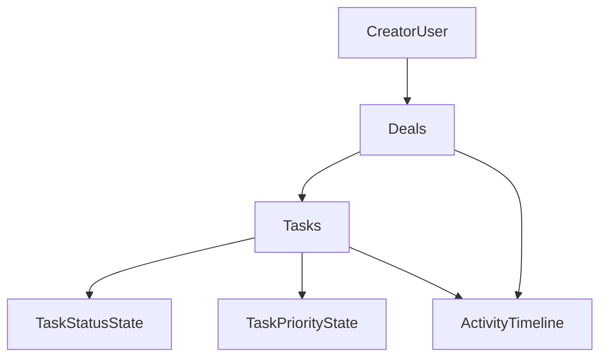
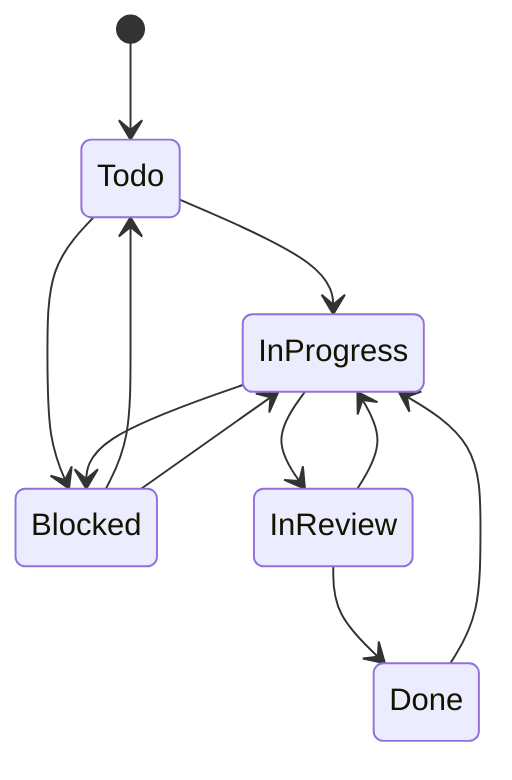

# Tasks Module

## Module Overview

Tasks are the execution layer of a deal. A deal captures commercial context; tasks capture the internal work required to deliver campaign outcomes.

This module is designed to:
- convert each deal into an operational workspace,
- make campaign execution measurable and trackable,
- provide a foundation for future calendar, notifications, and automation features.

## Business Goals

- **Operational visibility:** creators should always know what to do next for a campaign.
- **Execution consistency:** campaigns should move through repeatable internal steps.
- **Timeline reliability:** due dates and status transitions should expose risk early.
- **Future platform leverage:** task data should become the source for calendar, reminders, and AI recommendations.

## Tasks vs Deliverables

- **Tasks** represent private internal work (research, scripting, recording, editing, upload prep).
- **Deliverables** represent external obligations and outcomes visible to the brand.
- A single deliverable may depend on many tasks.
- Keeping them separate avoids workflow ambiguity and enables future role/permission boundaries.

## Why Tasks Belong to Deals

- Deal context (brand, contact, value, deadlines, stage) is required to prioritize and execute work.
- Ownership and authorization already anchor on deal ownership.
- Activity timelines and future billing modules are deal-centric; tasks align naturally with that model.

## Why Tasks Before Calendar

- Calendar is a presentation layer for dates.
- Tasks provide the canonical execution records and due-date semantics.
- Building tasks first ensures calendar integration reads from one trusted source.

## Creator Workflow Fit

Typical campaign flow:
1. Receive brief
2. Decompose work into tasks
3. Execute tasks through status stages
4. Track blockers and review steps
5. Complete execution before deliverable submission and publishing

## Domain Model

`Task` fields:
- `id`: UUID
- `userId`: owner tenant scope
- `dealId`: required parent relation
- `title`: short task label
- `normalizedTitle`: normalized value for optional duplicate checks and search hygiene
- `description`: optional long text
- `status`: workflow status (`Todo`, `InProgress`, `Blocked`, `InReview`, `Done`)
- `priority`: business priority (`Low`, `Medium`, `High`, `Urgent`)
- `dueDate`: optional due date
- `orderIndex`: sortable index for manual ordering per deal
- `createdBy`: user id of creator
- `updatedBy`: user id of last editor
- `archivedAt`: nullable archive timestamp
- `createdAt`: timestamp
- `updatedAt`: timestamp

## Relationships

Rules:
- A task belongs to exactly one deal.
- A deal can contain many tasks.
- Tasks cannot be created without a valid owned deal.

## Business Rules

1. **Deal ownership required:** every task operation validates the target deal belongs to the requesting user.
2. **No orphan tasks:** `dealId` foreign key is required; service also validates ownership chain.
3. **Soft archive first:** archive sets `archivedAt`; archived tasks are excluded from default active lists.
4. **Delete policy:** hard delete is allowed only for archived tasks.
5. **Ordering:** order is stable within each deal using `orderIndex`; reorder updates are transactional.
6. **Due date behavior:** due date is optional; overdue is derived at read-time from `dueDate` + non-`Done` status.
7. **Immutable tenancy:** `userId` is server-resolved from auth and never accepted from client input.

## Task Workflow State Machine

Status meaning:
- `Todo`: queued but not started.
- `InProgress`: actively being worked on.
- `Blocked`: cannot proceed due to dependency or issue.
- `InReview`: work complete, waiting for review/approval.
- `Done`: execution complete.

Invalid transitions (rejected by service):
- `Todo -> Done`
- `Blocked -> Done`
- `Done -> Todo`

## Priority System

- `Low`: optional/non-urgent supporting work.
- `Medium`: normal campaign execution work.
- `High`: work that impacts near-term deadlines or campaign quality.
- `Urgent`: immediate attention required; risk of missed delivery without action.

## Backend Architecture

Layering mirrors existing CRM patterns:
- **Validation:** `lib/crm/tasks/taskValidation.ts`
- **Form adapters:** `lib/crm/tasks/taskForm.ts`
- **Service/domain:** `lib/crm/tasks/taskService.ts`
- **Server actions:** `app/action/taskActions.ts`
- **Types/enums:** `types/task.ts`, `enums/task.ts`

Design principles:
- business logic in service, not UI,
- ownership checks in service for every read/write,
- transactions for write operations,
- typed service errors mapped to action-level response contracts,
- activity events recorded in same transaction as task mutations.

## Database Design

Task model requirements:
- required FK to `deals`,
- indexed for deal-scoped list reads and sorting,
- soft delete (`archivedAt`) support,
- user tenant scope (`userId`) for efficient filtering and future RLS policies.

Recommended indexes:
- `(dealId, isArchived, orderIndex)`
- `(dealId, status, isArchived)`
- `(dealId, priority, isArchived)`
- `(dealId, dueDate, isArchived)`
- `(userId, updatedAt)`

## Frontend Architecture

Deal-scoped task module components:
- `DealTasksSection`
- `TasksToolbar`
- `TasksTable`
- `TaskForm`
- `TaskDetailPanel` (MVP detail view)
- `TaskRowActions`
- `TasksEmptyState`
- `TasksSkeleton`

Integration and state:
- server page prefetches tasks with deal details,
- client section manages interaction state and modals,
- mutations use a shared `useTaskMutations` hook,
- list/search/filter state uses a dedicated `useDealTasks` hook.

## Deal Integration

Within deal detail page:
- replace tasks placeholder tab with `DealTasksSection`,
- show summary metrics:
  - upcoming tasks,
  - completed tasks,
  - progress percentage,
  - total task count.

Tasks should feel native to deal execution, not bolted on.

## Search, Filtering, Sorting

Search:
- `title`, `description`

Filters:
- status
- priority
- due date mode (`all`, `upcoming`, `overdue`, `none`)
- archive state (`active`, `archived`)

Sorting:
- due date
- recently updated
- priority
- manual order

## UX Standards

- clear loading states and skeletons,
- meaningful empty states for no tasks and no matches,
- toast feedback on success/failure,
- optimistic UI for quick status updates and ordering,
- responsive behavior across desktop and mobile,
- accessible controls with labels and keyboard-friendly interactions.

## Security Model

- authentication required for all task actions (`requireOnboardedUser`),
- authorization enforced through owned deal validation,
- no trust in client-supplied ownership values,
- query patterns remain compatible with future strict RLS rollout.

## Performance Strategy

- server-first data loading in deal detail route,
- parallel fetch with deal and activities,
- paginated list contract available for scale,
- minimal client state and deterministic refresh points,
- avoid duplicate fetches by centralizing task list querying.

## Future Compatibility (Not in MVP)

Design leaves extension points for:
- assignees and team members,
- comments and threaded discussion,
- file attachments,
- checklists and subtasks,
- time tracking,
- reminders and notifications,
- calendar synchronization,
- AI task suggestions,
- recurring task templates.

## Engineering Standards

- SOLID boundaries between validation, service, action, and UI layers,
- DRY reuse of CRM shared components and helpers,
- KISS scope for MVP while preserving extension seams,
- strict TypeScript typing and shared contracts,
- no duplicated business logic across list/detail surfaces.

## Workspace Alignment Update

Tasks now operate as one tab module inside the Deal Workspace shell and share the same modular boundaries used by Deliverables, Notes, and Files:

- `types` contracts
- `validation/service` layer
- server actions
- list + mutation hooks
- isolated section component
