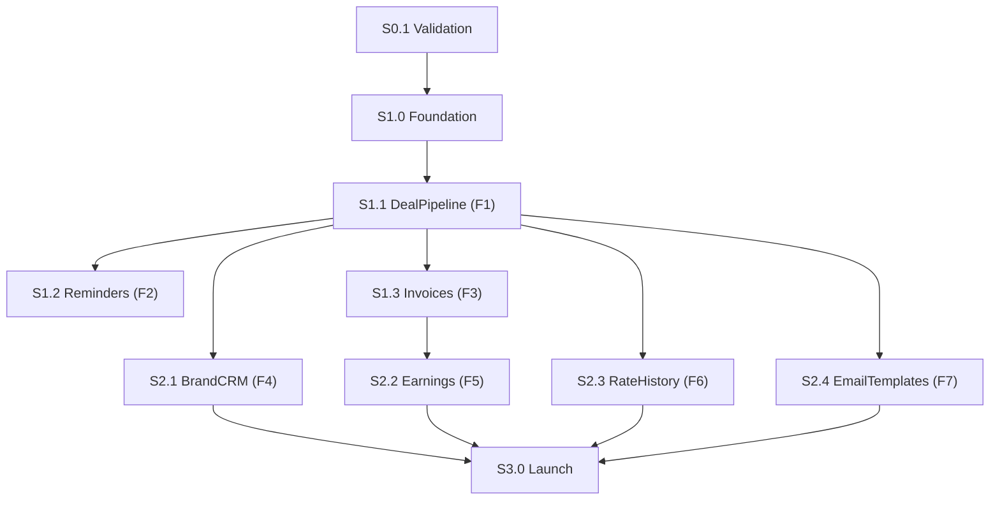

# slices.md - Vertical Delivery Plan

This file breaks the build into shippable vertical slices.
Work one slice at a time. Do not break previously completed slices.

---

## Slice Rules

- A slice is complete only when it works end-to-end for a user flow.
- Every slice must include a smoke test path.
- New work must not regress already-completed slices.
- Keep slices additive and backward-compatible unless a breaking change is approved.

---

## Current State

- Source of truth for checklist status: `context/progress-tracker.md`
- Current phase/week (from tracker): Phase 0, pre-Week 1

---

## Slice Index

| Slice ID | Slice | Maps To | Priority | Status Source |
|---|---|---|---|---|
| S0.1 | Validation and signal collection | Phase 0 | P0 | `context/progress-tracker.md` |
| S1.0 | Product foundation and core scaffolding | Phase 1 Week 2 | P0 | `context/progress-tracker.md` |
| S1.1 | Deal pipeline board + detail workflow | F1 | P0 | `context/progress-tracker.md` |
| S1.2 | Automated reminders + notifications | F2 | P0 | `context/progress-tracker.md` |
| S1.3 | Invoice generation and status lifecycle | F3 | P0 | `context/progress-tracker.md` |
| S2.1 | Brand contact database | F4 | P1 | `context/progress-tracker.md` |
| S2.2 | Earnings dashboard analytics | F5 | P1 | `context/progress-tracker.md` |
| S2.3 | Rate history and trend intelligence | F6 | P1 | `context/progress-tracker.md` |
| S2.4 | Email template library | F7 | P2 | `context/progress-tracker.md` |
| S3.0 | Launch hardening and go-live execution | Phase 3 | P0 | `context/progress-tracker.md` |

Infrastructure cross-cuts (Auth, DB/RLS, Stripe, Email/Cron, Analytics, Hosting) are dependencies for multiple slices and must be tracked alongside feature slices.

---

## Ordered Slice Breakdown

### S0.1 - Validation and demand proof

Goal:

- Confirm user pain, interest, and messaging before full build acceleration.

Acceptance baseline:

- Validation tasks are complete in tracker.
- Problem framing and target user assumptions are documented.

### S1.0 - Foundation

Goal:

- Ensure auth, app shell, data foundations, and project scaffolding are in place.

Acceptance baseline:

- Secure auth path is functional.
- Baseline app structure supports CRM and dashboard modules.

### S1.1 - Deal pipeline (F1)

Goal:

- User can add, view, and move deals across lifecycle stages with usable detail views.

Acceptance baseline:

- Add/edit deal works.
- Board and detail flow works.
- Stage progression works.

### S1.2 - Reminders (F2)

Goal:

- Time-based reminders reach users through email and in-app channels.

Acceptance baseline:

- Reminder schedule generation exists.
- Cron delivery path works.
- Notification surfacing works.

### S1.3 - Invoices (F3)

Goal:

- User can generate, send, track, and close invoice loop from deal data.

Acceptance baseline:

- Invoice generation from deal data works.
- Invoice lifecycle states are visible and updateable.

### S2.1 - Brand CRM (F4)

Goal:

- User can manage brands, contacts, and collaboration history.

Acceptance baseline:

- Searchable brand records exist.
- Deal-to-brand linkage is functional.

### S2.2 - Earnings dashboard (F5)

Goal:

- User gets clear earned/outstanding/overdue visibility and trend context.

Acceptance baseline:

- Core metrics render correctly from current data.
- Dashboard visual summaries support decision-making.

### S2.3 - Rate history (F6)

Goal:

- User can analyze historical rates and direction over time.

Acceptance baseline:

- Filterable historical rate views work.
- Trend visualization is accurate.

### S2.4 - Email templates (F7)

Goal:

- User has reusable communication templates tied to deal workflows.

Acceptance baseline:

- Templates are available and copyable.
- Variable placeholders resolve correctly.

### S3.0 - Launch execution

Goal:

- Convert completed product into a controlled launch with reliable operations.

Acceptance baseline:

- Launch checklist tasks are complete.
- Core user journey is stable in production-like conditions.

---

## Dependency Flow

---

## Per-Slice Quality Gate (Use Every Time)

- Scope is limited to a single slice or explicit sub-slice.
- Existing completed flows still work.
- Smoke test cases are run and documented.
- If data model/security/billing changes are needed, approval is captured first.
- `context/progress-tracker.md` is updated to reflect new status.

---

## How To Execute

1. Pick the next highest-priority unfinished slice.
2. Define smallest shippable sub-slice.
3. Implement end-to-end.
4. Run smoke checks.
5. Update tracker and proceed to next sub-slice.
